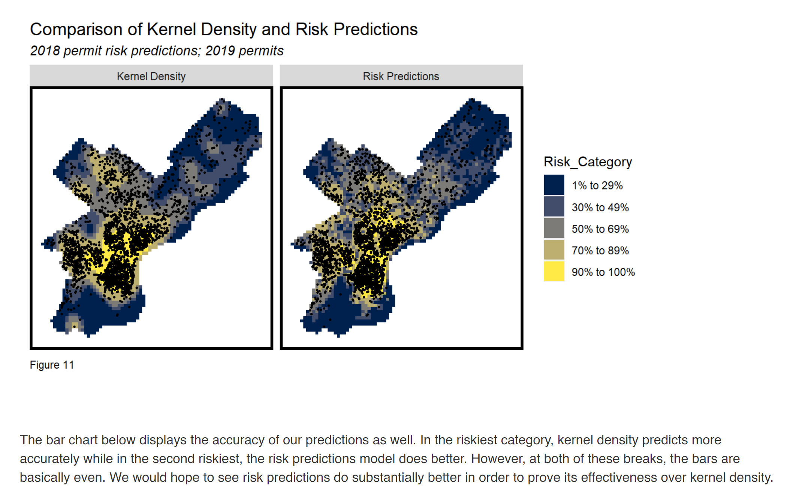
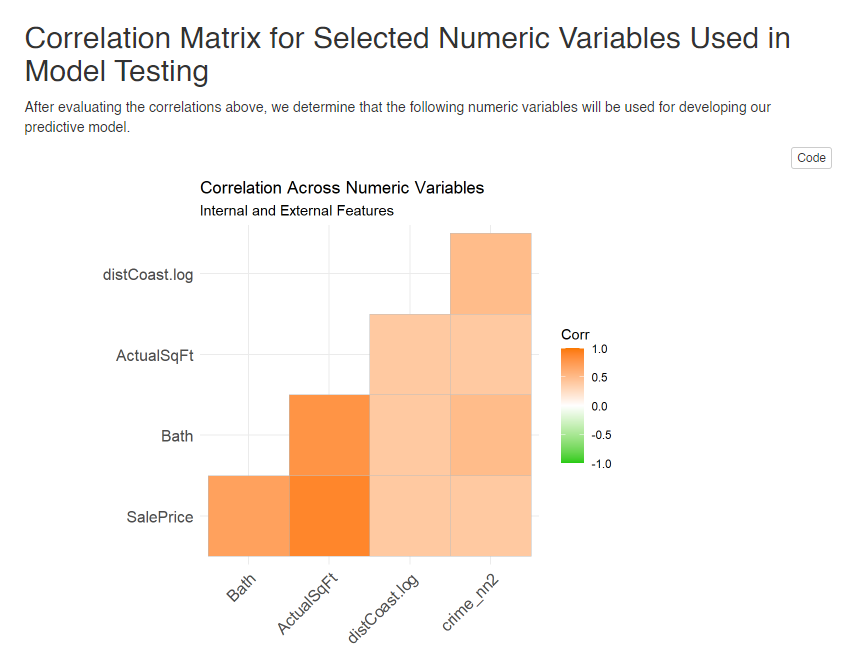
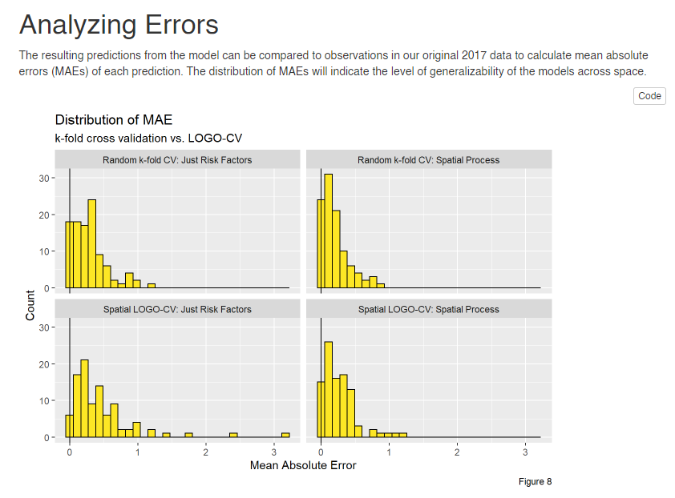

## Portfolio

---

### Data Analytics

[Predicting Gentrification in Philadelphia, PA using a Geospatial Risk Model](https://htmlpreview.github.io/?https://github.com/kristinchang/KristinTova508Final/blob/main/MUSA508_KristinTova_Final.html)

---
[Home Price Predictions in Miami and Miami Beach, FL](https://htmlpreview.github.io/?https://github.com/kristinchang/508Midterm/blob/main/The_Real_Houseprices_of_Miami_Final.html)

---
[Predictive Policing in Chicago, IL](https://htmlpreview.github.io/?https://github.com/kristinchang/508HW3/blob/main/ChangKristin_MUSA508_HW3.html)

---
[Forecasting Flood Inundation in Calgary, Canada and Denver, CO](https://htmlpreview.github.io/?https://github.com/kristinchang/CPLN675Midterm/blob/main/Chang_Epstein_Midterm.html)

---

### Writing and Design Samples

- [DRAFT Policy Memo: Recidivism Algorithm for Statewide Prison to Employment Iniative in Oakland, CA](/pdf/MUSA508_HW5_KristinChang.pdf)
- [DRAFT Policy Memo: Policy Recommendations for Crime Mapping in Oakland, CA](/pdf/CPLN520_FinalProject_KristinChang.pdf)
- [Cartography Sample: Map of Sausalito, CA - created in Adobe Illustrator](/pdf/KristinChang_CartographySample.pdf)
- [Graphic Design Sample: First Year City Planning Workshop Slides](/pdf/CityPlanningWorkshop_SamplePages.pdf)

---

---

Page template forked from <a href="https://github.com/evanca/quick-portfolio">evanca</a>

<!-- Remove above link if you don't want to attibute -->
