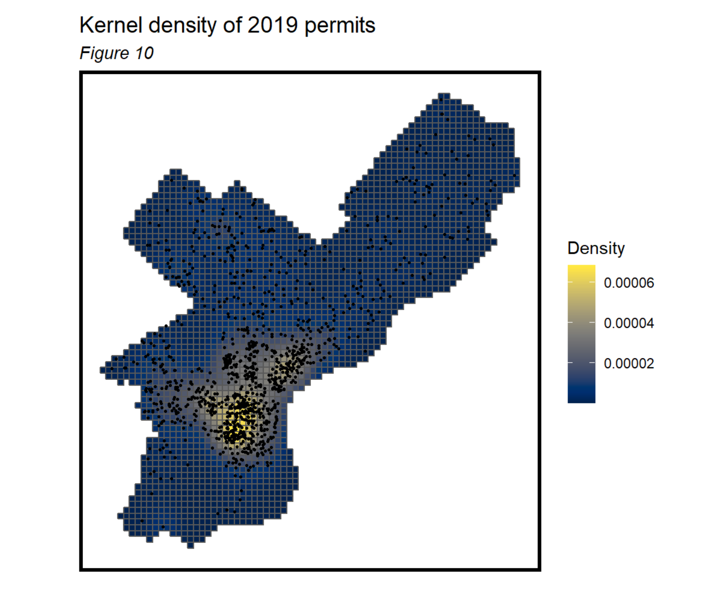
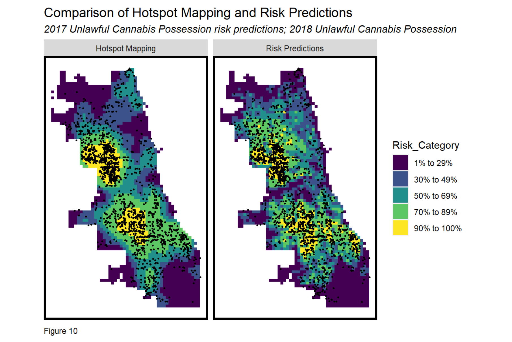
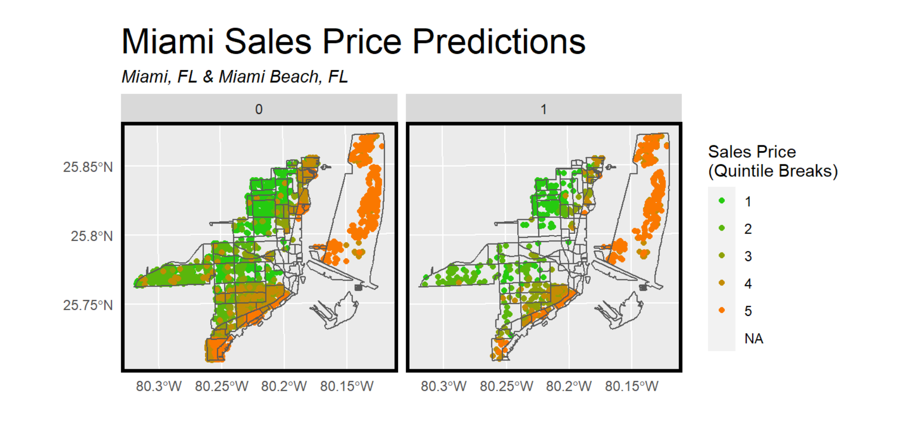

## Portfolio

---

### Data Analytics

[Forecasting Flood Inundation in Calgary, Canada and Denver, CO](https://htmlpreview.github.io/?https://github.com/kristinchang/CPLN675Midterm/blob/main/Chang_Epstein_Midterm.html)
  
This project utilizes a generalized linear model to predict areas of future flooding in Denver, Colorado trained on past data from the City of Calgary in Canada. The predictions are intended to hypothetically inform Denver City Agencies such as Public Works, Public Health, City Planning, and Emergency Management to better prepare for future flooding disasters. This was the midterm exercise for the Land Use and Environmental Modeling course taught in R at UPenn in Spring 2021. 

---
[Policymaker's Toolkit for a Green New Deal](https://kristinchang.github.io/MUSA550-Final-BazilChang/)
  
Toolkit for a Green New Deal consists of a Sentiment Analysis of tweets using the hashtag #GreenNewDeal, a Spatial Analysis of Fossil Fuel Infrastructure and Air Pollution, and an analysis of Air Pollution levels in Louisiana from 2001-2014 - all with interactive charts! These analyses are meant to provide digestible summaries of complex datasets for policymakers advocating for environmental justice in regions most impacted by fossil fuel production and climate change. This was the final project for the Geospatial Data Science in Python course at UPenn in Fall 2021.

---
[Saint Thomas Resilience Plan, City Planning Studio Fall 2021](https://www.design.upenn.edu/city-regional-planning/graduate/work/saint-thomas-resilience-plan)
  
The St. Thomas Resilience Plan was created in the 2nd year City Planning Studio for St. Thomas located in the U.S. Virgin Islands to address the island's vulnerability to climate change and sea level rise. Notable contributions include construction of a St. Thomas specific Social Vulnerability Index (pg. 24-25), Demographic and Socioeconomic analyses (pg.26-27), mapping traffic patterns (pg. 68), and graphic design and layout of the Existing Conditions section (pg. 24-29).

---
[Predicting Gentrification in Philadelphia, PA](https://htmlpreview.github.io/?https://github.com/kristinchang/KristinTova508Final/blob/main/MUSA508_KristinTova_Final.html)
  
This project consists of a Geospatial Risk Model to predict areas at risk of gentrification in Philly. Filings of new construction permits are used as a proxy for gentrification because they are strong indicators of new development. The predictions would hypothetically inform housing agencies that provide support or resources to individuals at risk of home foreclosure in order to help them maintain ownership status of their homes. This project was part of the final for the Public Policy Analytics course at UPenn in Fall 2020.

---
[Predictive Policing in Chicago, IL](https://htmlpreview.github.io/?https://github.com/kristinchang/508HW3/blob/main/ChangKristin_MUSA508_HW3.html)
  
This projects breaks down the process of building predictive policing models and why there is prevalent bias in these algorithms that makes them extremely harmful to black and brown communities. Such models are created on foundations of selection biases that perpetrate cycles of unjust over-policing. This is exemplified in my analysis of crime reports in Chicago for unlawful cannabis possession. This exercise was completed for the Public Policy Analytics course at UPenn in Fall 2020.

---
[Home Price Predictions in Miami and Miami Beach, FL](https://htmlpreview.github.io/?https://github.com/kristinchang/508Midterm/blob/main/The_Real_Houseprices_of_Miami_Final.html)
  
This exercise in mimicking the hedonic pricing method, which states home sales prices are determined by their internal and external characteristics, results in fairly accurate home sale price predictions (6th best model in the class!) utilizing OLS regression. The narrative includes a deep dive into evaluation methods and measuring generalizability to hypothetically recommend the model to an online real-estate marketplace company. This project was the midterm competition for the Public Policy Analytics course at UPenn in Fall 2020.

---

### Writing and Design Samples

- [DRAFT Policy Memo: Recidivism Algorithm for Statewide Prison to Employment Iniative in Oakland, CA](/pdf/MUSA508_HW5_KristinChang.pdf)
- [DRAFT Policy Memo: Policy Recommendations for Crime Mapping in Oakland, CA](/pdf/CPLN520_FinalProject_KristinChang.pdf)
- [CASE STUDY: Vineyard Wind 1, First U.S. Large-Scale Offshore Wind Project in Massachusetts](/pdf/CCTermPaper1.pdf)

---

---

Page template forked from <a href="https://github.com/evanca/quick-portfolio">evanca</a>

<!-- Remove above link if you don't want to attibute -->
